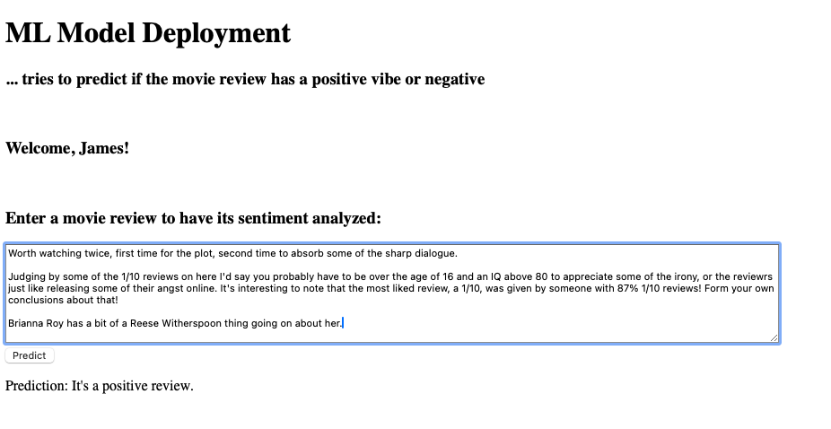
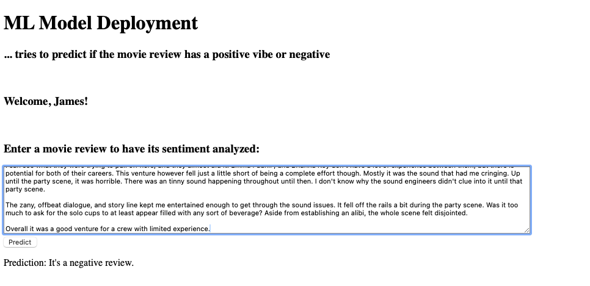

# SentimentAnalysis_Flask

## Demo: Sentiment Analysis model training and deployment with Flask
Purpose: to perform sentiment analysis model training and deployment to a simple web site with Flask backend.

### Folders
- src: contains the web site with simple HTML frontend, Flask APIs and pickled trained model and vectorizer.
- model training: Jupyter notebook file.

### How the model was trained
The Jupyter notebook file shows the entire process of downloading data, data wrangling, preprocessing texts with NLTK, vectorizing corpus, training the Logistic Regression model with Scikit-Learn, evaluation, and pickling for deployment using joblib. Labeled IMDB data was used to train the model. Since it's a simple Logistic Regression model, no GPU is needed.

You can open it in Google Colab [here](https://colab.research.google.com/github/wayneike/SentimentAnalysis_Flask/blob/main/Model%20Training/sentiment_analysis_imdb.ipynb#scrollTo=GmnX5qJH5AIM)

### Screenshots

